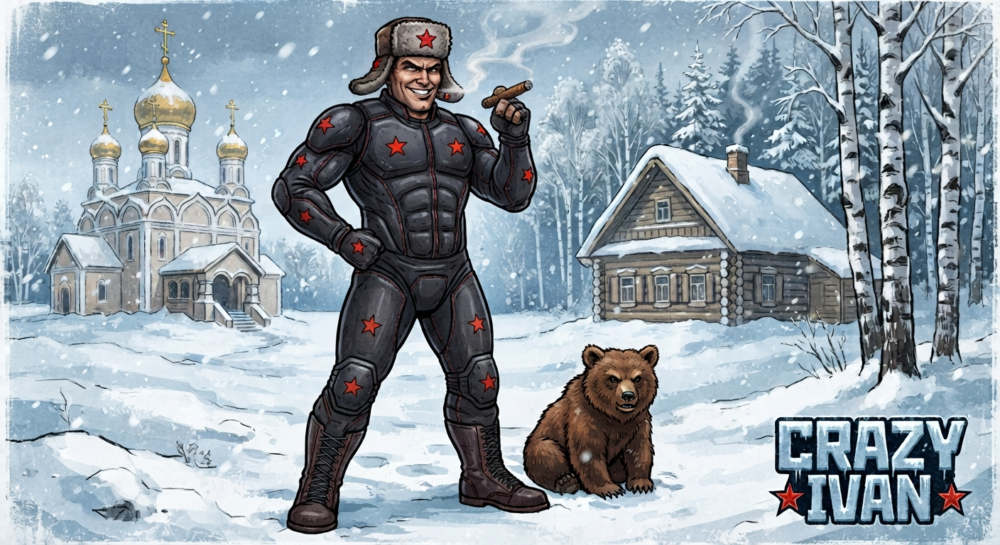

# NIC-Crazy_Ivan

**English** · [Čeština](README.cs.md) · [Русский](README.ru.md)

**A neural suit:** 126 to 254 electrodes and 16 to 64 inertial units on a suit you put together
from pieces like a sleeve, a trouser leg, the torso or a headband.

The muscles' own signals and the body's motion go to a computer in the backpack, a Radxa ROCK 5T
with up to two Hailo-10H AI accelerators or a Raspberry Pi 5 with one, and the whole body becomes
the controller for a computer or a game.

**Coming soon™.** Well — not *that* soon.

> **Beta 0.1:** a concept at the design stage, nothing is built yet; what is closed, what is
> open and what is only an estimate is under [Status](STATUS.md).

---

## What it is

A suit covered in electrodes and motion sensors. It is made of pieces: a sleeve, a trouser
leg, the torso, a headband around the head and more. Each piece is a module of its own, and you
can join pieces in any combination. A bigger suit is simply more pieces on the same bus.

## Tomography

The whole project rests on tomography. The electrodes are not tied to one common point, as they
are in classic recording. Within each block, the electrodes of different channels cross one
another, so every channel measures a mix of signals.

The reason is that you never put the suit on exactly the same way twice. So we don't follow an
exact point on the body. We follow how signals resemble each other and how they evolve.

## Parts

| part | what it is |
|---|---|
| [**Rubaška**](rubaska/README.md) | the suit itself: the pieces with their sensing modules |
| [**Nataša**](natasa/README.md) | the unit in the headband: headphones, two microphones, vibration and buttons |
| [**Mamka**](mamka/README.md) | the base board: the clock for the whole suit, the sound bridge, the line drivers and the suit's power |
| [**Baťa**](bata/README.md) | the computer in the backpack, a Radxa ROCK 5T or a Raspberry Pi 5, with Umnica, the Hailo-10H |
| [**Kormilica**](kormilica/README.md) | the Raspberry Pi's power board: its 5.1 V and its Hailo-10H |
| [**Terem**](terem/README.md) | the board under a ROCK 5T: its two Hailo-10H with a supply each, and the eFuse that feeds the ROCK |
| [**Babuška**](babuska/README.md) | the battery and its BMS, the hard-shell backpack, the power variants |
| [**Porjadok**](porjadok/README.md) | what holds for every module: processor, firmware, links between boards |
| [**software**](software/README.md) | the code: the protocols as Python codecs with tests, later the firmware and Baťa's programs |

## The family in the backpack

Mamka is Russian slang for a motherboard, and the rest of the backpack joined her family. The
names are Russian, written in Latin letters the Czech way:

| who | meaning | what it does |
|---|---|---|
| **Mamka** | mum | the base board: runs the suit and feeds her own children, the Rebjata |
| **Baťa** | dad, and in slang the boss | computer A: a ROCK 5T or a Raspberry Pi 5, with Mamka on his header |
| **Umnica** | the clever daughter | the Hailo-10H, who does the thinking for dad |
| **Kormilica** | the wet nurse | feeds a Raspberry Pi and its Umnica, on its header |
| **Terem** | the daughters' upper chamber | the board in a ROCK 5T's two M.2 slots: both Umnicas with a supply each, and the ROCK's eFuse |
| **Babuška** | grandma | the battery: she keeps the pantry, and everyone eats from her |
| **Ključnica** | the housekeeper with the keys | the BMS: she holds the keys to Babuška's pantry |
| **Deduška** | grandpa, Babuška's husband | computer B, if wanted: a full computer beside Baťa over Ethernet, with the glasses and the programs |
| **Ďaďa Sem** | Uncle Sam, the uncle from America | the cameras that watch everything: two USB cameras into Baťa, read by his second Umnica |
| **Budilnik** | the alarm clock | the start button and its latch: one press wakes the household, and when everyone has shut down it lets the house go dark |
| **Storož** | the night watchman | Baťa's halt daemon: on a fatal fault he stops the household's services, keeps the terminal open and says why |
| **Kommunalka** | a communal flat | the backpack: the whole family lives in it and shares one kitchen, Babuška |
| **Chodiki** | the wall clock with weights | the suit's clock, which the whole household lives by |

On the body, the suit is **Rubaška**, the shirt you are born in. Mamka's own children, the
**Rebjata** (the sensing modules), hang on the **Pupovina**, the umbilical cord: the lines that
bring them power, the clock and data. The small processors in the glove and the foot, the
**Vnučata**, are her grandchildren. The household's rules are the **Porjadok**, and its power, from
Babuška down, the **Pitanije**.

The pieces combine freely:

| piece | variant | what it is |
|---|---|---|
| Baťa | Raspberry Pi 5 | Kormilica on his header and Mamka on top, Umnica on Kormilica |
| Baťa | Radxa ROCK 5T | Mamka on his header, Terem in his two slots with one or two Umnicas; the profiles *normal* and *brutal* |
| the power | 5 A | the BMS lets out 5 A: Baťa alone |
| the power | 10 A | the BMS lets out 10 A: Baťa and Deduška, with room to spare |

- **Baťa on a Raspberry Pi, 5 A:** the plain suit, the least power.
- **Baťa on a ROCK 5T, 5 A:** two Umnicas, and in his *brutal* profile the whole system with
  glasses on his USB-C.
- **Baťa and Deduška, 10 A:** Baťa runs only the suit, and Deduška is a full computer with the
  glasses; the suit is his mouse and keyboard.

The details are under [Baťa](bata/README.md) and [Babuška](babuska/HARDWARE.md#power-variants), and
why each name under [Names](NAMES.md).

## Assistants

Nataša is the hardware in the headband; the assistants are programs on Baťa that use it, each
with a name of its own. They need no electrodes, so for them the headband and the backpack
(Mamka, Baťa and Babuška) are enough, without the sensing modules. Only
Míša adds hardware of its own: a unit on the forehead with a radar, ultrasound and an IMU,
plugged into Nataša.

| assistant | what it does |
|---|---|
| [**Soňa**](sona/README.md) | for the deaf: listens all the time and tells by vibration what is happening around |
| [**Míša**](misa/README.md) | the watchdog: a radar and ultrasound watch for obstacles and warn through the headphones and the headband |
| [**Taťána**](tatana/README.md) | writes and reads: types what you dictate and reads text aloud, books included |
| [**Nikita**](nikita/README.md) | rhythm you can feel: the beat of the music as vibration |

They run as modes, switched on as needed. At a social event or anywhere with many people, and
when walking with a companion, Míša and Soňa stay off: the companion guides, close contact would
set Míša off all the time, and an alarm shows in how the people around react.

---

MIT licence, see [LICENSE](LICENSE).
